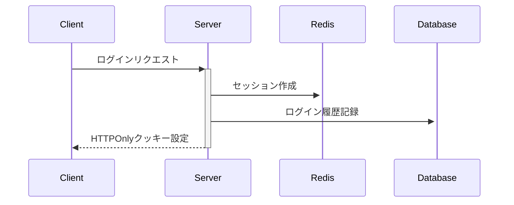
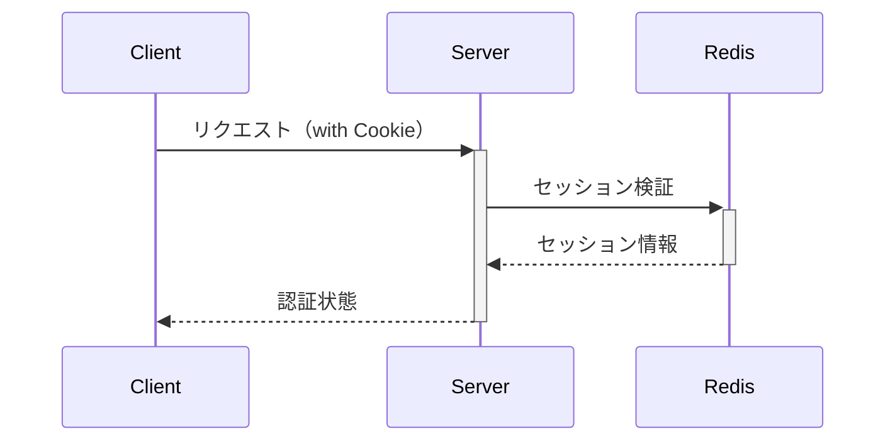

# セキュアな認証システムの設計ドキュメント

## 1. 認証アーキテクチャの基本方針

### クライアントサイド
- メモリ上での状態管理（Zustandなど）
- LocalStorage/SessionStorageは使用しない
- HTTPOnlyクッキーでのトークン管理

### サーバーサイド
- Redisでのセッション管理
- 分散システムでのセッション共有
- トークン検証の一元管理

## 2. 具体的な実装構成

### フロントエンド（Next.js）
```typescript
// 状態管理
interface AuthState {
  user: User | null;
  isAuthenticated: boolean;
}

// メモリ上での状態管理
const useAuthStore = create<AuthState>((set) => ({
  user: null,
  isAuthenticated: false,
  setUser: (user: User) => set({ user, isAuthenticated: true })
}));
```

### バックエンド（Next.js API Routes）
```typescript
// セッション管理
const sessionConfig = {
  store: new RedisStore({ client: redis }),
  cookie: {
    httpOnly: true,
    secure: process.env.NODE_ENV === 'production',
    maxAge: 24 * 60 * 60 * 1000,
    sameSite: 'strict'
  }
}
```

### データベース設計
```sql
-- セッション関連テーブル
CREATE TABLE user_sessions (
  session_id VARCHAR PRIMARY KEY,
  user_id UUID NOT NULL,
  created_at TIMESTAMP NOT NULL,
  expires_at TIMESTAMP NOT NULL
);

-- ログイン履歴
CREATE TABLE login_history (
  id UUID PRIMARY KEY,
  user_id UUID NOT NULL,
  logged_in_at TIMESTAMP NOT NULL,
  ip_address VARCHAR,
  user_agent VARCHAR
);
```

## 3. 認証フロー

1. ログインフロー


2. 認証状態チェック


## 4. セキュリティ対策

### 実装すべき対策
1. セッションセキュリティ
- セッションIDの暗号化
- 定期的なセッションローテーション
- 同時ログインの制御

2. CSRF対策
```typescript
app.use(csurf({
  cookie: {
    httpOnly: true,
    sameSite: 'strict'
  }
}));
```

3. レートリミット
```typescript
const rateLimit = {
  windowMs: 15 * 60 * 1000,
  max: 100
};
```

### モニタリング
```typescript
// セッションアクティビティ監視
const sessionMonitor = {
  trackActivity: async (sessionId: string) => {
    await redis.hset(`session:${sessionId}:activity`, {
      lastAccess: Date.now(),
      userAgent: req.headers['user-agent']
    });
  }
};
```

## 5. エラーハンドリング

```typescript
class AuthenticationError extends Error {
  constructor(
    message: string,
    public statusCode: number = 401
  ) {
    super(message);
    this.name = 'AuthenticationError';
  }
}

const errorHandler = (error: Error) => {
  if (error instanceof AuthenticationError) {
    return {
      statusCode: error.statusCode,
      message: error.message
    };
  }
  return {
    statusCode: 500,
    message: 'Internal Server Error'
  };
};
```

## 6. 運用考慮事項

1. パフォーマンス最適化
- Redisのコネクションプール
- セッションデータの最小化
- 適切なインデックス設計

2. スケーラビリティ
- 水平スケーリング対応
- セッションストアの冗長化
- ロードバランシング考慮

3. 監視とロギング
- アクセスログ
- エラーログ
- セキュリティイベント

このドキュメントは基本的な設計方針を示すものであり、実際の実装時には要件に応じて適宜調整が必要です。